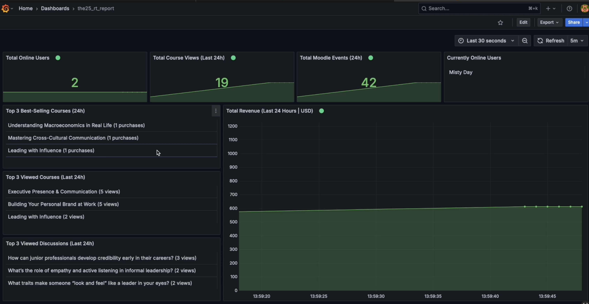
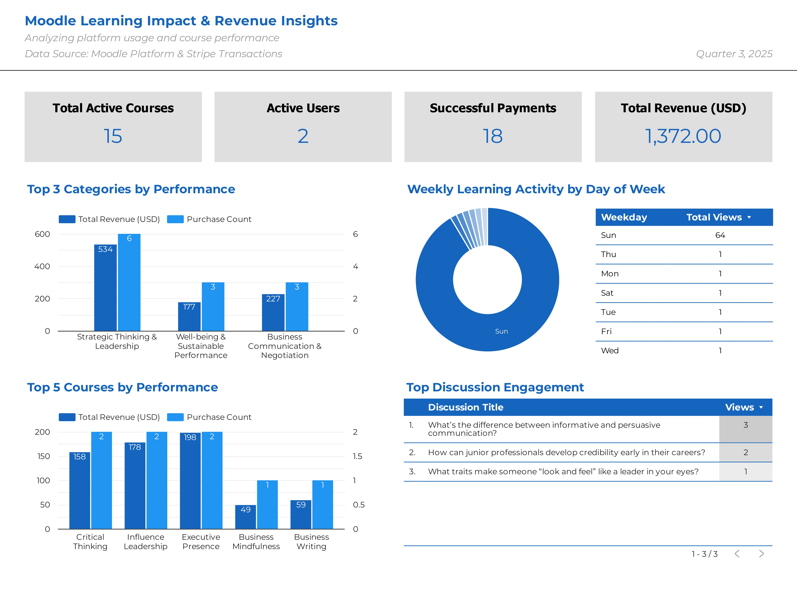
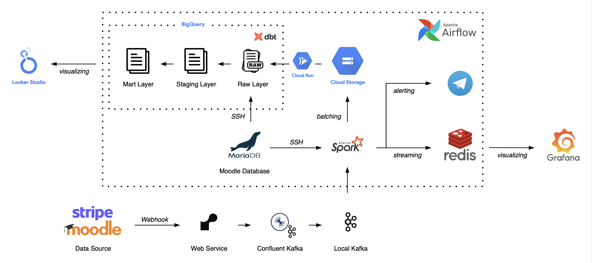
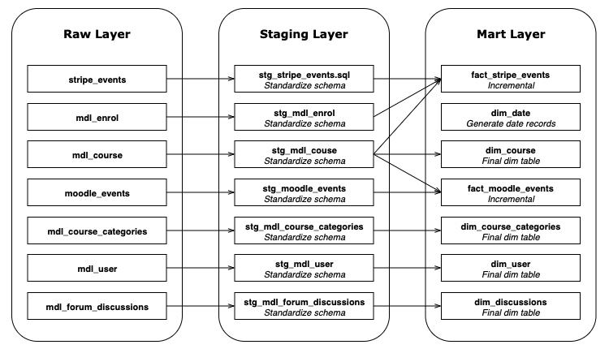
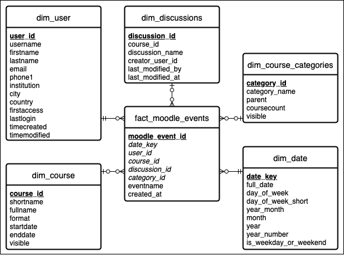
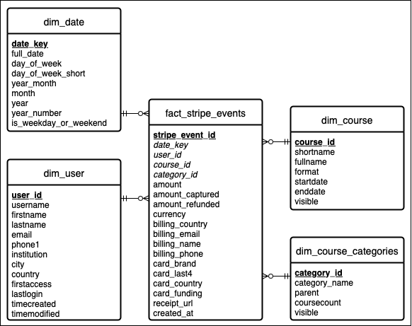

# LMS Event-Driven Analytics Pipeline

## 1. Overview  
This project implements a scalable **event-driven analytics system** to process and analyze **learning events** from Moodle (LMS) and **spending behaviors** from Stripe. The architecture supports both **batch ELT** and **real-time streaming ETL**, enabling advanced analytics, visualization, and alerting.

  

  

---

## 2. System Overview  
The pipeline integrates data ingestion, transformation, and visualization across cloud and local environments.  

- **Data Sources**: Moodle (learning activities), Stripe (payment transactions)  
- **Ingestion**: Moodle & Stripe webhooks → Confluent Cloud Kafka → Local Kafka  
- **Processing**: Apache Spark for both batch and streaming workloads  
- **Storage & Transformation**: Google Cloud Storage (GCS), BigQuery (raw, staging, mart layers), Redis  
- **Orchestration**: Apache Airflow  
- **Visualization**: Looker Studio (batch), Grafana (real-time)  
- **Alerting**: Telegram (via threshold detection on sliding windows)

  

---

## 3. Implementation Steps  

### Batch ELT Flow  
1. **Ingestion**:  
   - Airflow DAG consumes batch data from Kafka  
   - Stores as Parquet files in GCS  

2. **Raw Layer Load**:  
   - Cloud Function triggers to push parquet files into **BigQuery Raw Layer**  

3. **Moodle DB Migration**:  
   - Airflow migrates Moodle DB tables to **Raw BigQuery** as raw dimension tables  

4. **Transformation with dbt**:  
   - dbt models process **Raw → Staging → Mart layers** in BigQuery  

5. **Analytics**:  
   - Looker Studio dashboards for historical and aggregated insights  

### Streaming ETL Flow  
1. **Streaming Jobs**:  
   - Airflow triggers Spark Streaming jobs for Moodle and Stripe events  

2. **Processing & Storage**:  
   - Transforms event streams  
   - Stores results in **Redis** for low-latency queries  

3. **Real-Time Visualization**:  
   - Grafana dashboards for live monitoring  

4. **Alerting**:  
   - Sliding window aggregations detect threshold breaches  
   - Sends alerts to **Telegram**  

---

## 4. Data Lineage  
The lineage illustrates how data moves through ingestion, transformation, and consumption layers, ensuring **traceability, governance, and observability**.  

  

---

## 5. Analytical Data Model  
The analytical layer in BigQuery mart is modeled using **star schemas**, optimized for reporting and BI.  

- **Moodle Mart Schema**:  

  

- **Stripe Mart Schema**:  

  
